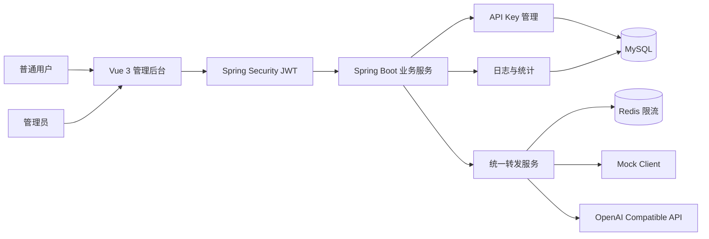
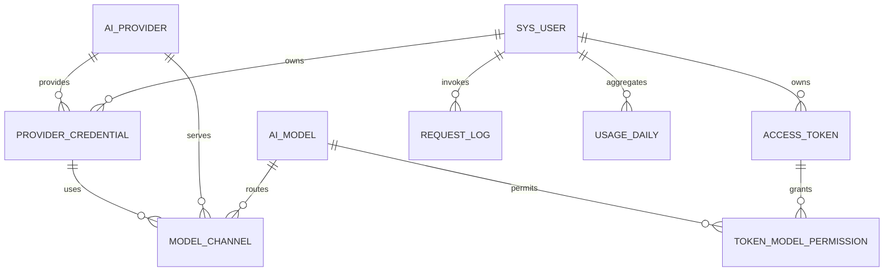

# KeyBridge AI

## Windows 一键启动

先确认本机 MySQL（3306）和 Redis（6379）已经启动，然后在项目根目录执行：

```powershell
powershell -ExecutionPolicy Bypass -File .\scripts\start-demo.ps1
```

如果本机 MySQL 的 `root` 密码不是 `root`，请使用：

```powershell
powershell -ExecutionPolicy Bypass -File .\scripts\start-demo.ps1 -DatabasePassword "你的MySQL密码"
```

脚本会自动启动 Spring Boot 与 Vue，启用 Mock 转发和演示账号，并打开登录页。答辩前可执行以下命令完成服务、健康检查、演示登录和页面访问自检：

```powershell
powershell -ExecutionPolicy Bypass -File .\scripts\check-demo.ps1
```

- 普通用户：`demo_user / demo123456`
- 管理员：`admin / admin123456`
- 前端：`http://localhost:5173/login`
- Swagger：`http://localhost:8080/swagger-ui/index.html`
- 健康检查：`http://localhost:8080/api/health`

> 课题名称：AI API 密钥管理与统一转发平台的设计与实现

## 项目介绍

KeyBridge AI 是一个面向多 AI 服务商的 API 密钥管理、统一请求转发与用量分析平台。用户可以集中保存自己的上游 API Key，通过统一接口调用不同模型；管理员可以管理用户、服务商并查看全站调用情况。

本项目采用前后端分离架构，覆盖用户权限、数据加密、统一网关、Redis 限流、调用审计、数据聚合和可视化等内容，适合作为大学软件工程、计算机科学相关专业的 Web 全栈期末项目。

> 项目默认使用 Mock 转发模式，无需购买真实 AI API 即可完成全部答辩演示。

## 项目预览

前端提供以下主要页面：

- 登录与注册
- 首页数据仪表盘
- API Key 管理
- AI 调用测试
- 个人调用日志
- 管理员用户管理
- 管理员全站日志

访问地址：

| 服务 | 地址 |
|---|---|
| 前端页面 | `http://localhost:5173` |
| 后端 API | `http://localhost:8080` |
| Swagger UI | `http://localhost:8080/swagger-ui.html` |

## 技术栈

### 后端

- Java 21
- Spring Boot 3.5.7
- Spring Security 6 + JWT
- MyBatis-Plus 3.5.12
- MySQL 8.4
- Redis 7
- AES-256-GCM
- SpringDoc OpenAPI
- Maven

### 前端

- Vue 3
- TypeScript
- Vite
- Element Plus
- Vue Router
- Pinia
- Axios
- ECharts

### 部署与工具

- Docker Compose
- Swagger UI / Apifox
- Git

## 系统架构



统一转发流程：

```text
JWT 身份认证
  -> 校验服务商
  -> 校验 Key 所有权、状态和有效期
  -> Redis 用户日限额与 Key 分钟限额
  -> AES-GCM 解密 API Key
  -> Mock 或 OpenAI Compatible 调用
  -> 写入请求日志
  -> 原子更新每日统计
  -> 返回统一响应
```

## 功能说明

### 1. 用户与权限

- 用户注册、登录、退出和修改密码
- BCrypt 密码哈希
- JWT 无状态认证
- `USER`、`ADMIN` 两级角色
- 管理员启用或禁用用户
- 前端动态菜单和路由守卫

### 2. API Key 管理

- 用户新增、编辑、启用、停用和删除 API Key
- API Key 使用 AES-256-GCM 加密保存
- 每次加密使用随机 IV，相同 Key 的密文不同
- 前端仅显示 `********abcd` 格式的脱敏信息
- 普通用户只能管理自己的 Key
- 管理员可以查看和管理全部 Key 的脱敏信息
- 完整密钥、数据库密文均不会通过接口返回

### 3. AI 服务商与模型

- 服务商编码、Base URL、协议和超时时间配置
- OpenAI Compatible 协议支持
- 平台模型和上游模型映射
- 模型渠道优先级及权重字段
- 服务商、模型和渠道启用状态管理

### 4. 统一 AI 转发

- 统一接口：`POST /api/proxy/chat`
- 参数包括 `provider`、`model`、`keyId`、`prompt`
- 根据 `keyId` 查找当前用户的加密 API Key
- 解密后在内存中构造上游 Authorization 请求头
- 默认 Mock 模式，便于无真实 Key 演示
- 可切换 OpenAI Compatible 真实调用
- 当前实现为非流式聊天响应

### 5. Redis 限流

- 每个用户每天最多调用 100 次
- 每个 API Key 每分钟最多调用 10 次
- Redis Lua 脚本原子检查并递增两个计数器
- 超过额度返回 HTTP 429
- Redis 不可用时返回 HTTP 503
- 用户每日额度按 `Asia/Shanghai` 自然日计算

### 6. 调用日志

每次进入转发链路的请求都会记录：

- 请求追踪编号 `requestId`
- 用户 ID
- 服务商和模型
- API Key ID
- 输入、输出及总 Token
- 调用耗时
- HTTP 状态码
- 成功或失败状态
- 错误摘要
- 调用时间

为保护隐私，日志不保存 Prompt、模型回答、Authorization 请求头或完整 API Key。

### 7. 数据统计

- 调用总数、成功数和失败数
- 成功率和平均响应时间
- Token 总用量
- 最近 7、30、90 天趋势
- 服务商调用排行
- 模型调用排行
- 普通用户仅查看自己的统计
- 管理员可查看全站或指定用户统计

## 项目结构

```text
API TOKEN中转站/
├── frontend/                         # Vue 3 前端
│   ├── src/api                       # Axios 接口封装
│   ├── src/components                # 通用组件
│   ├── src/layouts                   # 后台布局
│   ├── src/router                    # 路由及权限守卫
│   ├── src/stores                    # Pinia 状态
│   ├── src/views                     # 页面
│   └── package.json
├── src/main/java/com/keybridge/
│   ├── common/
│   │   ├── api                       # 统一响应
│   │   ├── config                    # 公共配置及演示数据
│   │   ├── crypto                    # AES-GCM、SHA-256
│   │   ├── exception                 # 全局异常处理
│   │   └── security                  # JWT、Spring Security
│   └── module/
│       ├── auth                      # 注册登录
│       ├── user                      # 用户管理
│       ├── provider                  # 服务商与 API Key
│       ├── model                     # 模型与渠道
│       ├── proxy                     # 统一转发
│       ├── ratelimit                 # Redis 限流
│       ├── log                       # 调用日志
│       ├── statistics                # 数据统计
│       ├── token                     # 平台访问令牌
│       └── audit                     # 审计日志
├── src/main/resources/db/
│   ├── schema.sql                    # 完整建表脚本
│   └── migration                     # 历史升级脚本
├── docker-compose.yml                # MySQL 与 Redis
├── pom.xml
└── README.md
```

## 数据库说明

数据库名称：`keybridge_ai`，字符集：`utf8mb4`。

| 表名 | 作用 | 关键字段 |
|---|---|---|
| `sys_user` | 用户和角色 | `username`、`password_hash`、`role`、`status` |
| `ai_provider` | AI 服务商配置 | `code`、`base_url`、`protocol_type` |
| `provider_credential` | 用户上游 API Key | `user_id`、`encrypted_key`、`key_suffix`、`status` |
| `ai_model` | 平台模型 | `model_code`、价格、最大 Token |
| `model_channel` | 模型与上游渠道映射 | `model_id`、`provider_id`、`credential_id` |
| `access_token` | 平台访问令牌 | `token_hash`、额度、有效期 |
| `token_model_permission` | 令牌模型权限 | `access_token_id`、`model_id` |
| `request_log` | 每次 AI 调用日志 | 用户、供应商、模型、耗时、状态和错误 |
| `usage_daily` | 每日聚合统计 | 日期、用户、供应商、模型、请求及 Token 数 |
| `audit_log` | 管理操作审计 | 操作人、资源、动作和 IP |

核心关系：



### 数据安全设计

- 用户密码：BCrypt 单向哈希
- 上游 API Key：AES-256-GCM 可逆加密，供转发时临时解密
- 平台访问令牌：SHA-256 哈希，数据库不保存可恢复明文
- 加密主密钥：通过 `CRYPTO_KEY` 环境变量提供
- JWT 签名密钥：通过 `JWT_SECRET` 环境变量提供
- 生产环境必须固定 `CRYPTO_KEY`；修改后将无法解密已有 API Key

### 数据库初始化与升级

新数据库直接执行：

```text
src/main/resources/db/schema.sql
```

旧数据库按顺序执行：

```text
src/main/resources/db/migration/V2__credential_owner.sql
src/main/resources/db/migration/V3__logging_and_statistics.sql
```

## 接口说明

除注册、登录和 Swagger 外，其余接口均需要：

```http
Authorization: Bearer <JWT>
```

统一响应格式：

```json
{
  "code": 200,
  "message": "success",
  "data": {}
}
```

### 认证接口

| 方法 | 地址 | 权限 | 说明 |
|---|---|---|---|
| POST | `/api/auth/register` | 公开 | 注册用户 |
| POST | `/api/auth/login` | 公开 | 登录并获取 JWT |
| GET | `/api/auth/profile` | 登录 | 当前用户资料 |
| POST | `/api/auth/change-password` | 登录 | 修改密码 |
| POST | `/api/auth/logout` | 登录 | 退出登录 |

### 用户与管理员接口

| 方法 | 地址 | 权限 | 说明 |
|---|---|---|---|
| GET | `/api/users` | 管理员 | 分页查询用户 |
| PATCH | `/api/users/{id}/status` | 管理员 | 启用或禁用用户 |
| GET | `/api/audit-logs` | 管理员 | 查询审计日志 |

### 服务商和 API Key

| 方法 | 地址 | 权限 | 说明 |
|---|---|---|---|
| GET | `/api/providers` | 登录 | 服务商列表 |
| POST | `/api/providers` | 管理员 | 新增服务商 |
| PUT | `/api/providers/{id}` | 管理员 | 修改服务商 |
| DELETE | `/api/providers/{id}` | 管理员 | 删除服务商 |
| GET | `/api/credentials` | 登录 | 用户看自己的，管理员看全部 |
| GET | `/api/credentials/{id}` | 本人或管理员 | API Key 脱敏详情 |
| POST | `/api/credentials` | 登录 | 新增加密 API Key |
| PUT | `/api/credentials/{id}` | 本人或管理员 | 修改 API Key |
| DELETE | `/api/credentials/{id}` | 本人或管理员 | 删除 API Key |

### 模型、渠道和平台令牌

| 方法 | 地址 | 权限 | 说明 |
|---|---|---|---|
| GET | `/api/models` | 登录 | 查询模型 |
| POST | `/api/models` | 管理员 | 新增模型 |
| PUT | `/api/models/{id}` | 管理员 | 修改模型 |
| DELETE | `/api/models/{id}` | 管理员 | 删除模型 |
| GET/POST | `/api/model-channels` | 管理员 | 查询或新增模型渠道 |
| PUT/DELETE | `/api/model-channels/{id}` | 管理员 | 修改或删除渠道 |
| GET | `/api/tokens` | 登录 | 查询自己的平台令牌 |
| POST | `/api/tokens` | 登录 | 创建平台令牌，明文只返回一次 |
| PATCH | `/api/tokens/{id}/status` | 本人 | 修改令牌状态 |
| DELETE | `/api/tokens/{id}` | 本人 | 删除令牌 |

### AI 转发接口

```http
POST /api/proxy/chat
Content-Type: application/json
Authorization: Bearer <JWT>
```

请求：

```json
{
  "provider": "openai",
  "model": "gpt-4.1-mini",
  "keyId": 1,
  "prompt": "请用三句话介绍人工智能"
}
```

响应：

```json
{
  "code": 200,
  "message": "success",
  "data": {
    "requestId": "f1c9...",
    "mode": "MOCK",
    "provider": "openai",
    "model": "gpt-4.1-mini",
    "content": "[Mock] 已通过 openai 调用模型...",
    "finishReason": "stop",
    "durationMs": 8,
    "usage": {
      "inputTokens": 6,
      "outputTokens": 15,
      "totalTokens": 21
    }
  }
}
```

### 日志与统计接口

| 方法 | 地址 | 权限 | 说明 |
|---|---|---|---|
| GET | `/api/request-logs` | 登录 | 普通用户看自己，管理员看全站 |
| GET | `/api/request-logs/{requestId}` | 登录 | 调用日志详情 |
| GET | `/api/statistics/summary?days=7` | 登录 | 汇总指标 |
| GET | `/api/statistics/trend?days=7` | 登录 | 按日趋势 |
| GET | `/api/statistics/providers?days=7` | 登录 | 服务商排行 |
| GET | `/api/statistics/models?days=7` | 登录 | 模型排行 |

日志列表支持 `provider`、`model`、`statusCode`、`success`、`startTime` 和 `endTime` 条件。

## 运行步骤

### 环境要求

- JDK 21
- Maven 3.9+
- Node.js 20+
- MySQL 8.4
- Redis 7
- 可选：Docker Desktop

### 方式一：Docker 启动 MySQL 和 Redis

```bash
docker compose up -d
```

首次创建数据卷时，MySQL 会自动执行 `schema.sql`。如果已经存在旧数据卷，请手动执行迁移 SQL。

默认连接信息：

```text
MySQL: localhost:3306
数据库: keybridge_ai
账号: root
密码: root
Redis: localhost:6379
```

### 配置后端环境变量

Spring Boot 不会自动读取普通 `.env` 文件。请在 IDE 运行配置、系统环境变量或终端中设置变量。

PowerShell 示例：

```powershell
$env:DB_USERNAME="root"
$env:DB_PASSWORD="root"
$env:JWT_SECRET="keybridge-demo-jwt-secret-at-least-32-bytes"
$env:CRYPTO_KEY="keybridge-demo-encryption-key-do-not-change"
$env:PROXY_MODE="MOCK"
$env:DEMO_DATA_ENABLED="true"
$env:PRICING_SOURCE_URL="https://jeniya.chat/api/pricing_new"
mvn spring-boot:run
```

正式环境应使用随机生成的 `JWT_SECRET` 和 `CRYPTO_KEY`，并将 `DEMO_DATA_ENABLED` 设为 `false`。
`PRICING_SOURCE_URL` 可省略，模型广场默认每 10 分钟同步一次公开价格；同步失败时会继续使用最近一次成功数据或项目内置价格快照。

### 启动前端

```bash
cd frontend
npm install
npm run dev
```

Vite 默认将 `/api` 代理到 `http://localhost:8080`。

### 切换真实 AI 服务

```text
PROXY_MODE=OPENAI_COMPATIBLE
```

然后在服务商管理中配置类似：

```text
code: openai
baseUrl: https://api.openai.com/v1
protocolType: OPENAI_COMPATIBLE
```

再由用户添加真实 API Key。当前客户端会请求：

```text
{baseUrl}/chat/completions
```

## 测试账号

当后端设置 `DEMO_DATA_ENABLED=true` 时，启动过程会自动创建以下数据：

| 角色 | 用户名 | 密码 | 可用功能 |
|---|---|---|---|
| 管理员 | `admin` | `admin123456` | 全部管理功能和全站数据 |
| 普通用户 | `demo_user` | `demo123456` | 自己的 Key、调用和统计 |

同时自动创建：

- 服务商：`OpenAI Compatible`，编码 `openai`
- 管理员 Mock Key：`sk-mock-admin-demo`
- 普通用户 Mock Key：`sk-mock-user-demo`
- 自动补齐分页展示的演示成员账号，使平台至少拥有 128 个用户；仪表盘通过用户概览接口实时同步正常用户数量

Mock Key 会通过项目自身的 AES-GCM 逻辑加密后写入数据库，只适用于 `PROXY_MODE=MOCK`。

> 演示账号仅用于本地测试和答辩，部署到公开环境前必须关闭演示数据并修改密码。

## 测试建议

后端测试：

```bash
mvn test
```

前端类型检查与构建：

```bash
cd frontend
npm run build
```

建议重点验证：

1. 未登录访问后台会跳转到登录页。
2. 普通用户无法访问管理员页面和接口。
3. 数据库 `encrypted_key` 与输入明文不同。
4. API Key 列表仅返回脱敏字段 `maskedKey`。
5. 普通用户无法读取或调用其他用户的 Key。
6. 第 11 次同 Key 分钟请求返回 HTTP 429。
7. 成功、失败和限流请求都能进入日志和统计。
8. 切换 Mock 与 OpenAI Compatible 模式时接口格式保持一致。

## 答辩演示流程

建议将整个演示控制在 8 到 10 分钟。

### 1. 项目背景与架构

说明多 AI 服务商带来的密钥分散、接口不统一、用量不可追踪等问题，展示系统架构图和技术栈。

### 2. 用户登录与权限

1. 使用 `demo_user / demo123456` 登录。
2. 展示普通用户菜单。
3. 尝试访问管理员路径，说明前后端双重权限控制。

### 3. API Key 安全管理

1. 打开 API Key 管理页面。
2. 展示 `********demo` 脱敏格式。
3. 新增一条测试 Key。
4. 在数据库查看 `encrypted_key`，证明保存的不是明文。
5. 说明 AES-GCM 随机 IV 和 `CRYPTO_KEY` 环境变量。

### 4. Mock 统一转发

1. 打开 AI 调用测试页面。
2. 选择 `openai`、模型和用户 Mock Key。
3. 输入 Prompt 并调用 `/api/proxy/chat`。
4. 展示统一响应、`requestId`、耗时和 Token 用量。
5. 说明切换真实 OpenAI Compatible API 只需改变模式和服务商配置。

### 5. 调用日志

1. 打开个人调用日志。
2. 使用 `requestId` 对应刚才的请求。
3. 展示供应商、模型、耗时、状态和 Token。
4. 强调日志不保存 Prompt、回答和 API Key。

### 6. Redis 限流

1. 快速使用同一个 Key 调用 11 次。
2. 展示第 11 次返回 HTTP 429。
3. 在日志中展示限流失败记录。
4. 解释 Lua 脚本保证双计数器原子性。

### 7. 仪表盘统计

展示调用总数、成功率、平均耗时、Token 用量、趋势图、服务商排行和模型排行。

### 8. 管理员功能

1. 退出并使用 `admin / admin123456` 登录。
2. 展示用户管理、账号禁用和全站日志。
3. 对比普通用户与管理员的数据范围。

### 9. 总结

总结系统实现了“密钥安全保存、统一调用、限流保护、日志追踪、数据分析”的完整闭环，并说明未来可扩展 SSE 流式输出、自动故障转移和费用告警。

## 项目创新点

### 1. 上游密钥与平台身份分离

用户通过 JWT 登录平台，而真实 AI API Key 只在后端解密并用于上游请求。前端和其他用户始终无法取得完整密钥。

### 2. AES-GCM 加密与严格脱敏

项目不是简单 Base64 或固定掩码保存，而是使用带认证标签和随机 IV 的 AES-256-GCM；数据库密文被篡改时解密会失败。

### 3. 可切换的统一转发客户端

转发层通过统一客户端接口隔离 Mock 和 OpenAI Compatible 实现。答辩时可零成本演示，部署时又可以平滑接入真实服务。

### 4. 双维度原子限流

使用一段 Redis Lua 脚本同时检查用户每日额度和 Key 每分钟额度，避免并发下先检查后递增导致的限流穿透。

### 5. 日志与统计同事务写入

一次调用同时产生明细日志与每日聚合数据，聚合使用 MySQL `ON DUPLICATE KEY UPDATE` 原子累加，减少实时仪表盘查询成本。

### 6. 隐私友好的可观测性

系统记录追踪和统计所需的信息，但主动排除 Prompt、模型回答、Authorization 和完整密钥，在可观测性与隐私之间取得平衡。

### 7. 完整的用户与管理员数据隔离

权限不只在前端隐藏菜单，还在后端 Service 和查询条件中限制资源所有权，防止通过修改 URL 或 ID 越权访问。

## 后续扩展

- SSE 流式聊天响应
- 多渠道权重路由和失败自动切换
- API Key 健康检查定时任务
- 用户额度充值与费用结算
- 邮件或站内用量告警
- Prompt 内容可选脱敏审计
- Docker 化前后端及 Nginx HTTPS 部署

## 说明

本项目用于软件工程课程学习和期末答辩。生产部署前还应补充 HTTPS、密钥管理服务、Refresh Token、数据库备份、监控告警和更严格的服务商地址校验。
